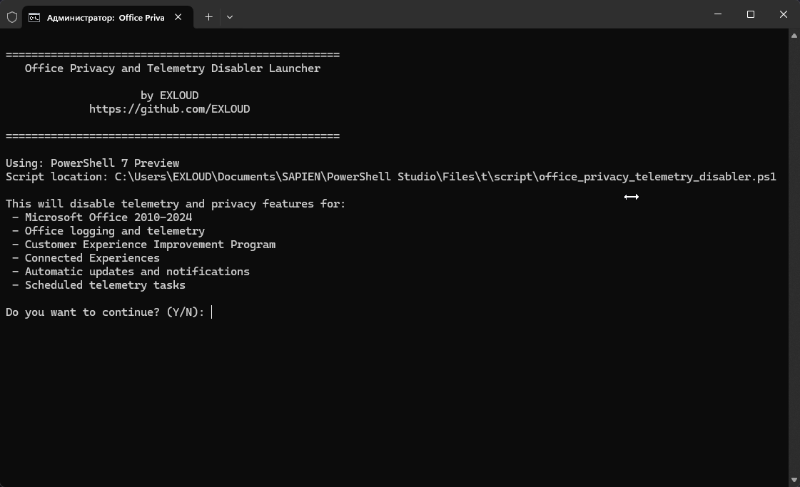

# Office Privacy and Telemetry Disabler

A comprehensive PowerShell script to disable Microsoft Office logging, telemetry, and privacy features across all Office versions (2010-2024).

## 🚀 Features

- **Multi-version support**: Works with Office 2010, 2013, 2016, 2019, 2021, and 2024
- **Comprehensive privacy protection**: Disables logging, telemetry, and data collection
- **Scheduled task management**: Disables Office telemetry and update tasks
- **Hosts file blocking**: Optional blocking of Microsoft telemetry servers
- **User-friendly interface**: Colored output with clear status indicators
- **Safe execution**: Backup creation and error handling

## 📋 What it disables

### Office Logging & Telemetry
- Microsoft Office application logging
- Client telemetry collection
- Verbose logging features
- OSM (Office Service Manager) logging and uploads

### Privacy Features
- Customer Experience Improvement Program (CEIP)
- Feedback collection
- Connected Experiences (Office 2016+)
- Online content downloads
- Watson error reporting

### Scheduled Tasks
- Office telemetry agents
- Subscription heartbeat tasks
- Background task handlers
- Automatic update tasks

### Network Communication
- Blocks telemetry hosts via hosts file (optional)
- Disables automatic updates
- Prevents data uploads to Microsoft servers

## 🛠️ Installation & Usage

### Method 1: Using the Launcher (Recommended)
1. Download both `Launcher.bat` and `office_privacy_telemetry_disabler.ps1`
2. Place both files in the same directory
3. Right-click on `Launcher.bat` and select "Run as administrator"
4. Follow the on-screen prompts

### Method 2: Direct PowerShell Execution
1. Download `office_privacy_telemetry_disabler.ps1`
2. Open PowerShell as Administrator
3. Run: `Set-ExecutionPolicy -ExecutionPolicy Bypass -Scope Process`
4. Execute: `.\office_privacy_telemetry_disabler.ps1`

## 🎯 Supported Office Versions

| Version | Year | Status |
|---------|------|--------|
| 14.0 | Office 2010 | ✅ Supported |
| 15.0 | Office 2013 | ✅ Supported |
| 16.0 | Office 2016/2019 | ✅ Supported |
| 17.0 | Office 2021 | ✅ Supported |
| 18.0 | Office 2024 | ✅ Supported |

## 🔧 Requirements

- **Operating System**: Windows 10/11
- **PowerShell**: Version 5.1 or higher (PowerShell 7 recommended)
- **Privileges**: Administrator rights required for registry and scheduled task modifications
- **Office**: Any version from 2010 to 2024

## 📸 Screenshots

### Main Interface
The script provides a clean, colored interface showing:
- Office version detection
- Registry modifications
- Scheduled task management
- Progress indicators

### Output Legend
- ✅ **Green**: Successfully completed actions
- 🔄 **Magenta**: Settings changed
- ℹ️ **Blue**: Information messages
- ⚠️ **Yellow**: Warnings
- ❌ **Red**: Errors
- ➡️ **Gray**: Items not found/skipped

## 🛡️ Safety Features

- **Backup creation**: Automatic backup of hosts file before modification
- **Error handling**: Comprehensive error catching and reporting
- **Registry validation**: Checks for existing registry paths before modification
- **Reversible changes**: Most changes can be reversed manually if needed
- **Non-destructive**: Only modifies privacy-related settings

## 🚨 Important Notes

1. **Administrator Rights**: Required for modifying system registry and scheduled tasks
2. **Office Restart**: Some changes require restarting Office applications
3. **Windows Defender**: The script temporarily adds hosts file to exclusions
4. **Backup**: Always backup your system before running system modification scripts

## 🔄 What happens after running?

After successful execution:
- Office telemetry and logging are disabled
- Privacy-invasive features are turned off
- Scheduled telemetry tasks are disabled
- (Optional) Telemetry hosts are blocked
- Office applications may need to be restarted

## 🤝 Contributing

Contributions are welcome! Please feel free to submit a Pull Request. For major changes, please open an issue first to discuss what you would like to change.

### Development
- The script uses PowerShell with colored output
- Registry modifications use proper error handling
- Scheduled task management includes comprehensive logging
- Code is modular and well-documented

## 📜 License

This project is licensed under the MIT License - see the [LICENSE](LICENSE) file for details.

## ⚠️ Disclaimer

This script modifies Windows registry and system settings. While designed to be safe, use at your own risk. Always backup your system before running. The authors are not responsible for any damage or data loss.

## 🙏 Acknowledgments

- Microsoft for providing comprehensive Office documentation
- PowerShell community for best practices
- Privacy advocates for highlighting the importance of telemetry control

## 📞 Support

If you encounter any issues:
1. Check the [Issues](../../issues) section
2. Ensure you're running as Administrator
3. Verify your Office version is supported
4. Check the console output for specific error messages

---

**Made with ❤️ by [EXLOUD](https://github.com/EXLOUD)**

*Protecting your privacy, one script at a time.*
